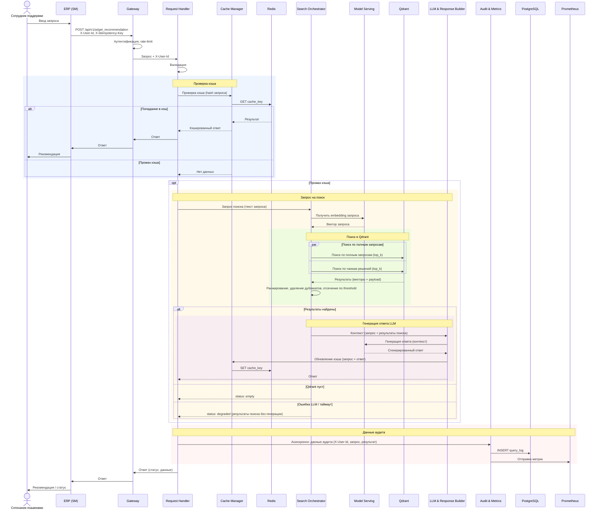

## Домашнее задание
### Многоуровневое проектирование: от C4 Model до спецификации API

#### Цель:
- спроектировать многоуровневую архитектуру AI-сервиса с использованием диаграмм C4 и спецификации API для согласования интеграции.

#### Описание/Пошаговая инструкция выполнения домашнего задания:
- Контекст: Продолжаем работу над проектом из первого ДЗ (или выберите свой кейс).

- Шаги выполнения:
1. C2 Container Diagram: Нарисуйте диаграмму контейнеров всей системы. Выделите Frontend, Backend, AI Service, Vector DB, SQL DB.
2. C3 Component Diagram: «Провалитесь» внутрь контейнера AI Service. Покажите его внутренние    компоненты (например, Controller, RAG Manager, LLM Client, Prompt Template Factory).
3. Sequence Diagram: Отрисуйте диаграмму последовательности для сценария «Пользователь запрашивает рекомендацию».
4. API Spec: Напишите спецификацию API (в формате YAML/Swagger) для взаимодействия между Backend и AI Service (эндпоинт /get_recommendation).

### Решение

#### ИИ-ассистент для службы поддержки

##### Проблема
- Служба поддержки ERP при получении обращения от пользователя не имеет единой базы решений запросов пользователей. Есть разрозненные How-To, отдельные базы знаний по направлениям.
- Текстовый поиск по ним малоэффективен из-за различий в формулировках.
- Базы знаний наполняются вручную и не всегда, часть решений остается только в самих обращениях.

##### Цель задачи
Внедрить корпоративный ИИ-сервис, который :
1. Предлагает найденные подходящие или схожие решения.
2. Периодически дополняет свою базу знаний из закрытых обращений.

##### Ключевые возможности (MVP)
| Функция | Описание | Бизнес-эффект |
|---------|----------|---------------|
| Проверка на дубли | При пополнении базы знаний чтобы не засорять одинаковыми или почти одинаковыми обращениями |  |
| Семантический поиск | Поиск по смыслу, а не по ключевым словам | Ускорение поиска готовых решений |
| Админ-панель | Мониторинг качества, ручная валидация | Контроль и дообучение системы |
| Локальное развёртывание | Все данные и модели внутри периметра компании | Соответствие политике безопасности |

##### Ограничения
- Запрещена передача данных во внешние облака и публичные API.
- Все компоненты (модели, векторная БД, оркестрация) разворачиваются on-prem в Kubernetes.
- Интеграция с ERP — через штатный oData-интерфейс, без модификации ядра системы.
- Частота обновления данных — не реже 1 раза в сутки.

#### Требования для реализации бизнес-процесса ИИ-ассистента службы поддержки

##### Контекст и бизнес-цель
В компании используется ERP-система SM для управлениями изменениями и поддержки системы ERP. Внутренняя СУБД ERP не поддерживает векторный поиск. Требуется внедрить локальный AI-сервис для:
- семантического поиска по существующим материалам в базе знаний на основе описаний на естественном языке.
- автоматического выявления семантических дубликатов при пополнении базы знаний ИИ-ассистента;
Все данные и вычисления остаются в on-prem периметре. Передача данных во внешние SaaS-сервисы запрещена.

[Весь контекст](./docs/context.md)

##### 1. C2 Container Diagram

[c2_container_01.drawio](./docs/c2_container_01.drawio)

##### 2. C3 Component Diagram: контейнер AI Service.

[c3_ai_service_01.drawio](./docs/c3_ai_service_01.drawio)

##### 3. Sequence Diagram для сценария «Пользователь запрашивает рекомендацию».

[get_recommendations.mermaid](./docs/get_recommendations.mermaid)

##### 4. OpenAPI (YAML) для /get_recommendation.
[openapi_get_recommend.yml](./docs/openapi_get_recommend.yml)