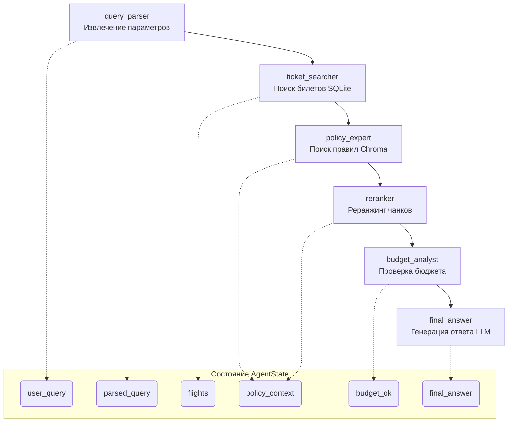
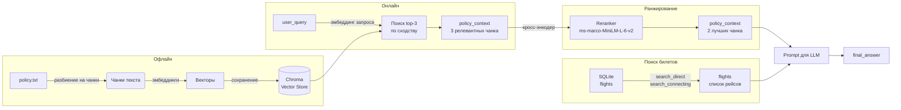

# Архитектура системы «Умный помощник для поиска авиабилетов» (Travel Assistant)

## 1. Ключевые компоненты

Система состоит из следующих основных модулей:

| Компонент | Назначение |
|-----------|------------|
| **LLM‑провайдер** | Базовая языковая модель (OpenRouter с GPT‑подобной моделью или локальная модель). Используется для извлечения параметров из запроса и генерации финального ответа. |
| **QueryParser** | Извлекает из пользовательского запроса город вылета, город прилёта и дату с помощью LLM и Pydantic‑парсера. |
| **FlightSearch** | Поиск авиабилетов в SQLite‑базе, построенной из CSV‑файла. Поддерживает прямые рейсы и поиск стыковочных маршрутов (одна пересадка). |
| **Векторное хранилище (Chroma)** | Хранит эмбеддинги фрагментов корпоративной политики командировок. |
| **Retriever** | Обёртка над Chroma для поиска релевантных фрагментов политики по сходству с запросом. |
| **PolicyExpert** | Агент, который по запросу извлекает из векторного хранилища 3 наиболее релевантных чанка политики. |
| **RerankerAgent** | Переупорядочивает извлечённые чанки политики с помощью кросс‑энкодера `cross-encoder/ms-marco-MiniLM-L-6-v2` и оставляет топ‑2 наиболее релевантных. |
| **BudgetAnalyst** | Проверяет, укладывается ли хотя бы один из найденных билетов в бюджетный лимит (по умолчанию 50 000 руб). |
| **FinalAnswerGenerator** | Формирует итоговый ответ пользователю, передавая LLM контекст из политики, список билетов и результат бюджетной проверки. |
| **Граф состояний (LangGraph StateGraph)** | Оркеструет последовательный вызов агентов, передавая между ними общее состояние `AgentState`. |

## 2. Архитектура системы и паттерны агентов

Система построена по многоагентной конвейерной архитектуре. Каждый агент представляет собой фильтр, который получает состояние, выполняет свою задачу и возвращает обогащённое состояние следующему агенту.

**Паттерн:** *Последовательный конвейер с единым разделяемым состоянием* (State‑based Pipeline).  
***Недостатки***: Изменение структуры разделяемого состояния может потребовать адаптации всех шагов конвейера.
Общее состояние описано типом `AgentState` и содержит все промежуточные данные:

```python
class AgentState(TypedDict):
    user_query: str           # исходный текст пользователя
    parsed_query: Dict        # распознанные город вылета, прилёта, дата
    policy_context: List[str] # найденные фрагменты политики
    flights: List[Dict]       # список подходящих билетов
    budget_ok: bool           # флаг прохождения бюджетного контроля
    final_answer: str         # сгенерированный ответ
```

Агенты **не общаются друг с другом напрямую**, а модифицируют состояние через свои методы `invoke(state)`.  
Оркестровку выполняет LangGraph `StateGraph`, который задаёт фиксированную последовательность вершин и рёбер:

```
query_parser  →  ticket_searcher  →  policy_expert  →  reranker  →  budget_analyst  →  final_answer
```

Такой подход обеспечивает:
- Прозрачную отладку (каждый шаг логируется).
- Простоту расширения (можно добавить новые шаги или условия ветвления).
- Чёткое разделение ответственности – каждый агент решает узкую задачу.

## 3. Схема взаимодействия агентов (Mermaid)



### Поток данных

1. **QueryParser** получает `user_query` и добавляет в состояние `parsed_query` (город вылета, прилёта, дата).  
2. **TicketSearcher** использует `parsed_query` для поиска билетов через `FlightSearch`. Результаты сохраняются в `flights`.  
3. **PolicyExpert** по исходному `user_query` извлекает из векторного хранилища 3 наиболее семантически близких чанка политики и помещает их в `policy_context`.  
4. **RerankerAgent** переранжирует эти чанки кросс‑энкодером и оставляет 2 самых релевантных, обновляя `policy_context`.  
5. **BudgetAnalyst** анализирует `flights` и устанавливает флаг `budget_ok`.  
6. **FinalAnswerGenerator** собирает весь контекст (`user_query`, обновлённый `policy_context`, `flights`, `budget_ok`) и с помощью LLM генерирует финальный ответ.

## 4. RAG Flow 

RAG-пайплайн объединяет два источника данных: неструктурированную политику из векторного хранилища и структурированные результаты поиска билетов из SQLite. Присутствует реранжинг чанков политики, повышающий качество контекста.




### Этапы RAG
1. **Офлайн‑индексация политики**  
   Текст из `policy.txt` разбивается на чанки (`RecursiveCharacterTextSplitter`, 500 символов с перекрытием 50). Каждый чанк преобразуется в эмбеддинг моделью `all-MiniLM-L6-v2` и сохраняется в векторную базу Chroma.

2. **Онлайн‑поиск политики (retrieval)**  
   При поступлении запроса `PolicyExpert` вычисляет его эмбеддинг и извлекает из Chroma 3 наиболее семантически близких чанка политики. Они сохраняются в состоянии как `policy_context`.

3. **Реранкинг (reranking)**  
   `RerankerAgent` использует кросс‑энкодер `cross-encoder/ms-marco-MiniLM-L-6-v2` для попарной оценки релевантности запроса и каждого из трёх чанков. Чанки сортируются по полученным скорам, после чего в `policy_context` остаются только два наиболее релевантных. Это отсеивает менее подходящие фрагменты и повышает точность контекста, подаваемого в LLM.

4. **Поиск билетов**  
   Параллельно `TicketSearcher` по извлечённым из запроса городам и дате выполняет SQL‑запросы в SQLite (прямые и стыковочные рейсы). Результат — список словарей с информацией о рейсах и ценах — помещается в `flights`.

5. **Сборка контекста и генерация ответа**  
   `FinalAnswerGenerator` формирует единый промпт, в который включает:
   - исходный `user_query`,
   - переранжированные `policy_context` (правила компании),
   - список `flights` (билеты с ценами),
   - флаг `budget_ok` (соответствие лимиту).

   Этот обогащённый промпт подаётся в LLM, которая генерирует финальный ответ, учитывая и политику, и конкретные варианты перелёта. Таким образом, ответ синтезируется на основе двух разнородных источников: релевантных документов из Chroma (улучшенных реранжингом) и точных данных из реляционной БД.