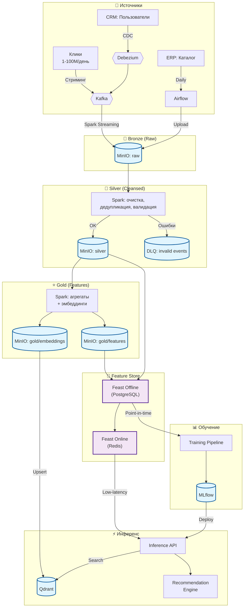

# Архитектура Data Pipeline: AI-система персонализированных рекомендаций

> **Примечание:** Конкретные названия продуктов (Kafka, Airflow, MinIO, Spark, Feast, Qdrant, MLflow и др.) приведены как примеры и не подразумевают реального сравнения или рекомендации. Выбор технологий в данном проекте должен основываться на детальном анализе требований, ограничений и ТКО.

## Схема архитектуры данных

---

## Текстовое описание архитектуры

Роль Feature Store (Feast) в предотвращении Training-Serving Skew — сводится к принципу «Один раз определили логику — используем везде». Он гарантирует, что модель на стадии обучения и на стадии предсказания видит одни и те же поля, с одними и теми же названиями, посчитанные по одной и той же логике, но только в разных временных срезах.

### Обзор архитектуры

архитектура реализует подход **Lakehouse** на базе open-source технологий с паттерном **ELT** (Extract → Load → Transform). Сырые данные загружаются в Data Lake, после чего трансформируются для аналитики и ML. Архитектура объединяет стриминговый и батчевые пути обработки в единой кодовой базе (Apache Spark), что соответствует принципам Delta-архитектуры.

Система обрабатывает три типа источников: события поведения пользователей (стриминг, 1-100M/день), каталог товаров из ERP (батч, ~1M товаров) и профили/транзакции из CRM (Debezium читает журнал транзакций БД и отправляет только изменения). 

### Описание компонентов

**Сбор данных (Ingestion):** Apache Kafka обеспечивает сбор стриминговых событий с партиционированием по user_id. Debezium обеспечивает CDC (Change Data Capture) из CRM в реальном времени через Kafka. Apache Airflow оркестрирует батчевые загрузки из ERP с расписанием, мониторингом и идемпотентностью.

**Обработка (Processing, ELT):** Apache Spark Structured Streaming очищает и обогащает стриминговые события в реальном времени. Spark Batch выполняет трансформации, дедупликацию и проверки качества для батчевых данных. Spark Structured Streaming использует checkpointing в Delta Lake и идемпотентные записи для обеспечения exactly-once processing. Feature Engineering (Spark + Feast) вычисляет ML-признаки: агрегаты поведения, popularity scores, session-based features. Embedding Service (PyTorch/TensorFlow) генерирует dense vector representations для товаров (на основе атрибутов, описаний) и пользователей (на основе поведения).

**Хранение (Storage):** MinIO + Delta Lake формируют Data Lake с поддержкой ACID-транзакций и time travel для воспроизводимости. Raw zone хранит необработанные данные (append-only), processed zone — очищенные и оптимизированные данные. Feast Feature Store обеспечивает dual-purpose хранение признаков: offline store (PostgreSQL) для обучения и online store (Redis) для инференса с low-latency доступом. Qdrant/Milvus — vector database для efficient approximate nearest neighbor (ANN) поиска эмбеддингов. Векторы в Qdrant хранятся с метаполем embedding_version, что позволяет отслеживать, какая модель эмбеддинга использовалась, и при необходимости перестроить векторы. Apache Atlas/DataHub — централизованный каталог метаданных с lineage tracking.

**Сервис и инференс (Serving):** MLflow управляет обучением моделей, A/B-тестированием и versioning моделей. Inference API (FastAPI/gRPC) в реальном времени извлекает признаки из Feast online store, выполняет векторный поиск в Qdrant и скоринг модели. Recommendation Engine реализует гибридный подход: коллаборативная фильтрация + контентная фильтрация + deep learning модели.

### Data Governance и консистентность

**Консистентность Feature Store (обучение ↔ инференс):** Feast выступает единым источником истины для ML-признаков. Идентичная логика вычисления признаков через FeatureViews обеспечивается для offline (обучение) и online (инференс) путей, что предотвращает training-serving skew — ключевую проблему ML-систем.

**Свежесть данных:** Стриминг-признаки (клик-счётчики) обновляются каждые 1-5 минут через Spark Streaming → Feast online. Батч-признаки (демография, категории) обновляются ежедневно через Spark batch → Feast offline. Векторные эмбеддинги пересчитываются ежедневно для товаров и в near-real-time для пользователей.

**Версионирование:** Delta Lake обеспечивает time travel и ACID-транзакции для полной истории данных. Feast версионирует признаки через feature services. MLflow версионирует модели и артефакты. Это позволяет воспроизвести любой обучающий датасет на конкретный момент времени.

**Data Quality:** Great Expectations выполняет автоматические проверки на каждом этапе: валидация схем, проверка null-значений, свежести данных, ссылочной целостности. Evidently AI мониторит data drift и качество моделей в продакшене.

**Data Security:** Маскирование PII на этапе ingestion, RBAC для доступа к данным, шифрование at rest и in transit. Apache Atlas обеспечивает lineage и аудит доступа.
