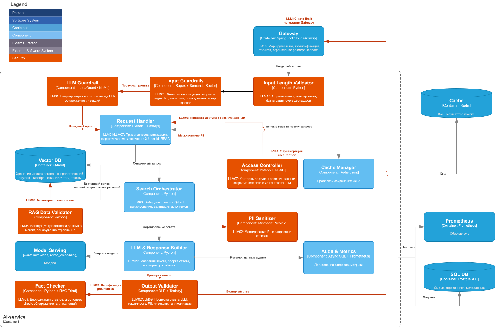

# ДЗ 06: Комплексное обеспечение качества AI-системы

## Цель

Спроектировать комплекс обеспечения качества AI-системы (RAG + LLM), включая безопасность, тестирование и наблюдаемость.

---

## Решение

### 0. Context
AI-ассистент для службы поддержки
**[context.md](docs/context.md)**
**[C2 container](docs/c2_container_01.drawio.svg)**
**[data pipeline](docs/data_pipeline.md)**

### 1. Security Layer

На архитектурную схему C3 добавлены security-компоненты для митигации актуальных угроз OWASP LLM Top 10 (2025).

**Добавленные компоненты:**

| Компонент | Технология | Назначение |
|-----------|------------|------------|
| Input Guardrails | Regex + Semantic Router | Обнаружение prompt injection (LLM01) |
| LLM Guardrail | LlamaGuard / NeMo | Deep-проверка промптов (LLM01) |
| PII Sanitizer | Microsoft Presidio | Маскирование PII (LLM02) |
| Output Validator | DLP + Toxicity | Проверка ответов на токсичность и утечки (LLM02/LLM09) |
| Access Controller | Python + RBAC | Контроль доступа к sensitive данным (LLM07) |
| RAG Data Validator | Python | Валидация целостности данных в Qdrant (LLM08) |
| Fact Checker | Python + RAG Triad | Верификация фактов, обнаружение галлюцинаций (LLM09) |
| Input Length Validator | Python | Ограничение длины промпта (LLM10) |

**Матрица митигации актуальных угроз:**
[owasp-mitigation.md](docs/owasp-mitigation.md)

**Схема C3: **

---

### 2. Testing Strategy (RAG Quality)

**План тестирования: [rag_quality_plan.md](docs/rag_quality_plan.md)**

**Метрики:**

| Метрика | Описание | Инструмент |
|---------|----------|------------|
| Faithfulness | Доля утверждений в ответе, подтверждённых контекстом | Ragas |
| Answer Relevancy | Соответствие ответа заданному вопросу | Ragas |
| Context Precision | Точность извлечения релевантного контекста | Ragas |
| Context Recall | Полнота извлечения контекста | Ragas |
| Hallucination Rate | Доля галлюцинаций в ответах | DeepEval |

**Golden Set:**
- Набор из 50+ эталонных вопросов с ожидаемыми ответами
- Покрытие всех направлений (по тикетам ERP, справочникам, процессам)
- Автоматический прогон через CI/CD пайплайн

---

### 3. Observability (Grafana Dashboard)

**Golden Signals:**

| Метрика | Описание | Источник |
|---------|----------|----------|
| Latency (p50/p95/p99) | Время обработки запроса | Prometheus |
| Traffic (RPS) | Количество запросов в секунду | Prometheus |
| Errors (4xx/5xx) | Доля ошибок | Prometheus |
| Saturation | Загрузка CPU/GPU/RAM | Prometheus |

**AI-специфичные метрики:**

| Метрика | Описание | Источник |
|---------|----------|----------|
| Token Usage (in/out) | Потребление токенов | Audit & Metrics |
| Average Cost per Request | Средняя стоимость запроса | Audit & Metrics |
| RAG Retrieval Score | Средний score найденных документов | Audit & Metrics |
| Hallucination Rate | Доля ответов с галлюцинациями | Fact Checker |
| Cache Hit Rate | Доля попаданий в кэш | Cache Manager |

**Алерты:**
- Latency p99 > 5s
- Error Rate > 5%
- Hallucination Rate > 10%
- Cache Hit Rate < 30%

**Спецификация дашборда: [docs/grafana_dashboard.md](docs/grafana_dashboard.md)**

---