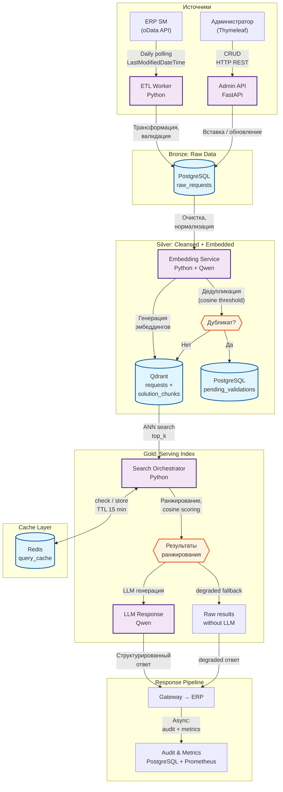

# Архитектура Data Pipeline: AI-ассистент для службы поддержки ERP

> Адаптированный Data Pipeline для RAG-системы с on-prem развёртыванием в Kubernetes.

## Схема архитектуры данных



---

## Текстовое описание архитектуры

### Обзор

Архитектура реализует **RAG-пайплайн** (Retrieval-Augmented Generation) с разделением на два независимых потока:

1. **Offline ETL Pipeline** — пополнение базы знаний из ERP по расписанию (1 раз/сутки)
2. **Online Query Pipeline** — обработка запросов пользователей в реальном времени

В отличие от типичей Lakehouse-архитектуры (Kafka + Spark + MinIO + Feast), данная система использует упрощённый стек: **Python ETL** (вместо Spark/Airflow), **PostgreSQL** (вместо MinIO Delta Lake), **Qdrant** (вместо Feature Store + отдельного Vector DB), **Qwen** (вместо MLflow). Это обусловлено спецификой задачи: работа с текстовыми обращениями, а не с числовыми признаками для рекомендательных систем.

### Описание компонентов

#### 1. ETL Worker (Python)

Оркестрирует загрузку данных из ERP SM через штатный oData-интерфейс.

| Параметр | Значение |
|----------|----------|
| Протокол | oData REST API |
| Расписание | Daily (cron) |
| Фильтр | `LastModifiedDateTime > last_sync`, `Status = Closed` |
| Идемпотентность | Upsert по `RequestID` |
| Retry | Exponential backoff, max 3 attempts |
| Circuit Breaker | Отключение при >5 ошибок подряд, восстановление через 5 мин |

**Поток:**
```
oData ERP → ETL Worker → PostgreSQL (raw_requests) → Embedding Service → Qdrant
```

Этапы:
1. **Polling**: Запрос новых/изменённых обращений через oData с фильтром по дате модификации
2. **Трансформация**: Нормализация полей, валидация обязательных атрибутов
3. **Загрузка**: Вставка/обновление в PostgreSQL (`raw_requests`)

#### 2. Embedding Service (Python + Qwen)

Генерирует векторные представления и проверяет дубликаты.

| Параметр | Значение |
|----------|----------|
| Модель эмбеддинга | Qwen-embedding (on-prem) |
| Размерность | ~1024 (зависит от модели) |
| Чанкинг | Разбиение решений на чанки по ~500 токенов |
| Порог дедупликации | cosine similarity > 0.92 |

**Поток дедупликации:**
```
raw_requests → Генерация эмбеддинга запроса → Qdrant (top-1 search)
   → cosine similarity > threshold → duplicate → pending_validations
   → cosine similarity ≤ threshold → уникальное → solution_chunks в Qdrant
```

**Хранилища Qdrant:**
- `requests` — эмбеддинги полных текстов обращений
- `solution_chunks` — эмбеддинги чанков решений (с payload: request_id, chunk_text, direction)

#### 3. Search Orchestrator (Python)

Основной RAG-пайплайн для обработки запросов.

**Поток:**
```
Query → Redis cache check
   → [cache miss] → Embedding (Qwen) → Qdrant search (requests + solution_chunks)
   → Ranking (cosine scoring + dedup) → LLM generation (Qwen)
   → Response → Redis cache update → async Audit
   → [cache hit] → Cached response
```

**Ранжирование:**
- Поиск по коллекции `requests` (полные обращения) → top_k results
- Поиск по коллекции `solution_chunks` (чанки решений) → top_k results
- Если чанк принадлежит `solution`, которое уже есть среди полных решений → пропуск дубликата
- Финальный скор: `cosine_similarity × weight` (полные обращения × 1.0, чанки × 0.8)
- Фильтрация по `similarity_threshold`

**Fallback:**
- LLM timeout/error → возврат raw результатов векторного поиска с `status: degraded`
- Qdrant пуст → `status: empty`

#### 4. Cache Manager (Redis)

| Параметр | Значение |
|----------|----------|
| TTL | 15 минут |
| Key | SHA256(query + metadata_filters + config) |
| Value | Сериализованный JSON-ответ |
| Инвалидация | По TTL + ручная через Admin API |

#### 5. Audit & Metrics

Асинхронная запись метаданных после формирования ответа (не блокирует ответ пользователю).

| Метрика | Описание |
|---------|----------|
| request_latency_ms | Время обработки запроса |
| cache_hit_ratio | Доля попаданий в кэш |
| llm_latency_ms | Время генерации LLM |
| vector_search_latency_ms | Время векторного поиска |
| dedup_rejected_count | Количество отклонённых дубликатов |
| dedup_pending_count | Количество дубликатов на ручной валидации |

---

## Схема данных PostgreSQL

### Таблицы

```sql
-- Сырые обращения из ERP
CREATE TABLE raw_requests (
    request_id VARCHAR(50) PRIMARY KEY,
    title TEXT NOT NULL,
    description TEXT,
    resolution TEXT,
    direction VARCHAR(100),
    status VARCHAR(50),
    created_at TIMESTAMP,
    modified_at TIMESTAMP,
    synced_at TIMESTAMP DEFAULT NOW(),
    raw_payload JSONB
);

-- Ожидает ручной подтверждения (дубликаты)
CREATE TABLE pending_validations (
    id SERIAL PRIMARY KEY,
    request_id VARCHAR(50) REFERENCES raw_requests(request_id),
    duplicate_of VARCHAR(50),
    similarity_score FLOAT,
    status VARCHAR(20) DEFAULT 'pending',  -- pending / approved / rejected
    validated_by VARCHAR(100),
    validated_at TIMESTAMP,
    created_at TIMESTAMP DEFAULT NOW()
);

-- Лог запросов (аудит)
CREATE TABLE query_log (
    id SERIAL PRIMARY KEY,
    trace_id VARCHAR(50) UNIQUE NOT NULL,
    user_id VARCHAR(100),
    query TEXT,
    top_k INT,
    similarity_threshold FLOAT,
    status VARCHAR(20),  -- ok / degraded / empty
    response_time_ms INT,
    cache_hit BOOLEAN,
    llm_used BOOLEAN,
    created_at TIMESTAMP DEFAULT NOW()
);

-- Состояние ETL
CREATE TABLE etl_state (
    id SERIAL PRIMARY KEY,
    last_sync_at TIMESTAMP,
    records_synced INT,
    errors_count INT,
    status VARCHAR(20),  -- success / partial / failed
    created_at TIMESTAMP DEFAULT NOW()
);
```

---

## Схема данных Qdrant

### Коллекция `requests`

| Поле | Тип | Описание |
|------|-----|----------|
| vector | float[1024] | Эмбеддинг полного текста обращения |
| payload.request_id | string | Ссылка на raw_requests |
| payload.title | string | Заголовок обращения |
| payload.direction | string | Направление поддержки |
| payload.status | string | Статус обращения |

### Коллекция `solution_chunks`

| Поле | Тип | Описание |
|------|-----|----------|
| vector | float[1024] | Эмбеддинг чанка решения |
| payload.request_id | string | Ссылка на исходное обращение |
| payload.chunk_index | int | Порядковый номер чанка |
| payload.chunk_text | string | Текст чанка |
| payload.direction | string | Направление поддержки |

---

## Потоки данных

### Поток 1: Offline ETL (пополнение базы знаний)

```
┌─────────┐    oData     ┌──────────┐   SQL    ┌────────────┐
│ ERP SM  │ ──────────►  │ ETL      │ ──────► │ PostgreSQL │
│ (source)│   polling    │ Worker   │         │ raw_requests│
└─────────┘              └──────────┘         └─────┬──────┘
                                                     │
                                                     │ trigger
                                                     ▼
                                            ┌────────────────┐
                                            │ Embedding      │
                                            │ Service        │
                                            └───┬────────┬───┘
                                                │        │
                                    ┌───────────┘        └──────────┐
                                    ▼                               ▼
                           ┌─────────────┐               ┌──────────────────┐
                           │   Qdrant    │               │ pending_validations│
                           │ (requests + │               │ (дубликаты)       │
                           │  chunks)    │               └──────────────────┘
                           └─────────────┘
```

### Поток 2: Online Query (обработка запроса)

```
┌──────────┐  REST   ┌──────────┐  HTTP   ┌──────────┐
│ Gateway  │ ──────► │ AI       │ ◄─────► │ Redis    │
│          │         │ Service  │  cache  │ (TTL 15m)│
└──────────┘         └────┬─────┘         └──────────┘
                          │
              ┌───────────┼───────────┐
              ▼           ▼           ▼
       ┌──────────┐ ┌──────────┐ ┌──────────┐
       │ Qwen     │ │ Qdrant   │ │ Qwen     │
       │ Embedding│ │ ANN      │ │ LLM      │
       └──────────┘ │ Search   │ └────┬─────┘
                    └──────────┘      │
                                      ▼
                               ┌──────────┐
                               │ Response │
                               │ → ERP    │
                               └──────────┘
```

### Поток 3: Admin CRUD (управление базой знаний)

```
┌──────────────┐  Thymeleaf  ┌──────────────┐  REST  ┌──────────────┐
│ Администратор│ ──────────► │ Admin API    │ ──────► │ AI Service   │
│              │             │ (Spring Boot)│         │ (FastAPI)    │
└──────────────┘             └──────────────┘         └──────┬───────┘
                                                             │
                                                    ┌────────┼────────┐
                                                    ▼        ▼        ▼
                                              ┌──────┐ ┌─────────┐ ┌───────┐
                                              │PG    │ │ Qdrant  │ │ Redis │
                                              │      │ │         │ │       │
                                              └──────┘ └─────────┘ └───────┘
```

---

## Гарантии и неисправности

### Идемпотентность

| Компонент | Механизм |
|-----------|----------|
| ETL Worker | Upsert по `RequestID` + `last_sync_at` в `etl_state` |
| Query API | `X-Idempotency-Key` → дедупликация в Redis (TTL = timeout) |
| Admin API | Операции идемпотентны по определению (CRUD) |

### Failure Modes

| Сценарий | Поведение |
|----------|-----------|
| ERP недоступен | ETL пропускает цикл, логирует ошибку, следующий цикл подхватит |
| Qdrant недоступен | `status: degraded` — возврат без векторного поиска |
| Qwen LLM недоступен | `status: degraded` — возврат результатов поиска без генерации |
| Redis недоступен | Работа без кэша (прямые запросы к Qdrant) |
| PostgreSQL недоступен | Критическая ошибка — ответ не формируется |
| Дубликат обнаружен | Автоматическая запись в `pending_validations`, уведомление администратора |

### Circuit Breakers

| Сервис | Порог срабатывания | Время восстановления |
|--------|-------------------|---------------------|
| oData ERP | >5 ошибок за 1 мин | 5 мин |
| Qwen Embedding | >3 таймаута за 1 мин | 3 мин |
| Qwen LLM | >3 таймаута за 1 мин | 3 мин |
| Qdrant | >5 ошибок за 1 мин | 5 мин |

---

## SLA и метрики

| Метрика | Целевое значение |
|---------|-----------------|
| Query latency (без LLM) | < 3 с |
| Query latency (с LLM) | < 5 с |
| Cache hit ratio | > 40% |
| ETL freshness | ≤ 24 часа |
| Dedup accuracy (auto-approve) | > 85% |
| Availability | 99.5% |

---

## Наблюдаемость

| Компонент | Инструмент | Метрики |
|-----------|------------|---------|
| AI Service | Prometheus | request_count, latency, cache_hit, llm_errors |
| ETL Worker | Prometheus | sync_count, sync_errors, last_sync_at |
| Embedding Service | Prometheus | embedding_latency, dedup_rejected, dedup_pending |
| PostgreSQL | pg_stat_statements | query_count, slow_queries |
| Qdrant | /metrics endpoint | search_latency, collection_size |
| Все сервисы | Grafana | Дашборды, алерты |

---

## Сравнение с шаблоном Lakehouse

| Шаблон (data_architecture.md) | Данный проект | Причина |
|-------------------------------|---------------|---------|
| Kafka (стриминг) | oData polling | ERP не предоставляет CDC/стриминг |
| Spark Structured Streaming | Python ETL | Объём данных <1M обращений, простая трансформация |
| Airflow | Cron scheduler | Нет сложной оркестрации, один пайплайн |
| MinIO + Delta Lake | PostgreSQL | SQL-достаточно для сырых данных, нет потребности в time travel |
| Feast Feature Store | Нет | RAG-задача, не рекомендательная система с признаками |
| MLflow | Qwen serving | Модель одна, versioning не критичен для MVP |
| Great Expectations | Валидация в ETL | Проще — встроенные проверки |
| Debezium (CDC) | oData polling | Источник не поддерживает CDC |
