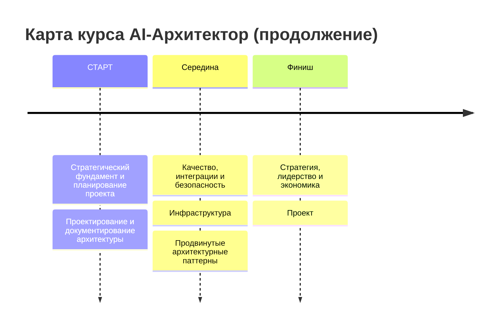
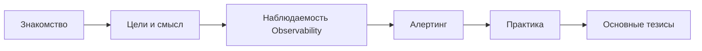
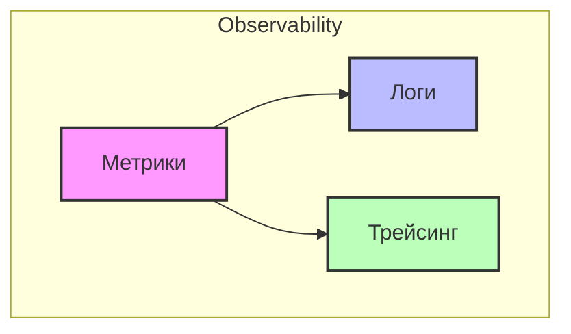
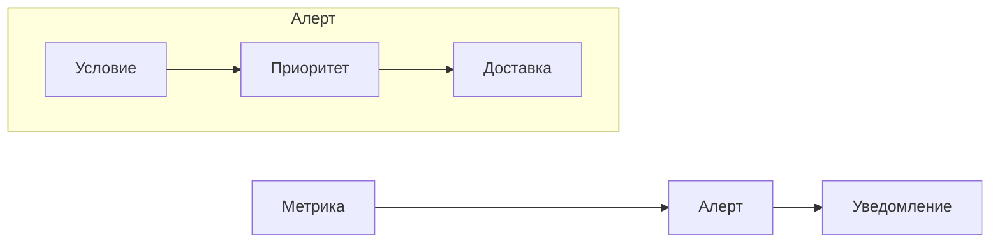
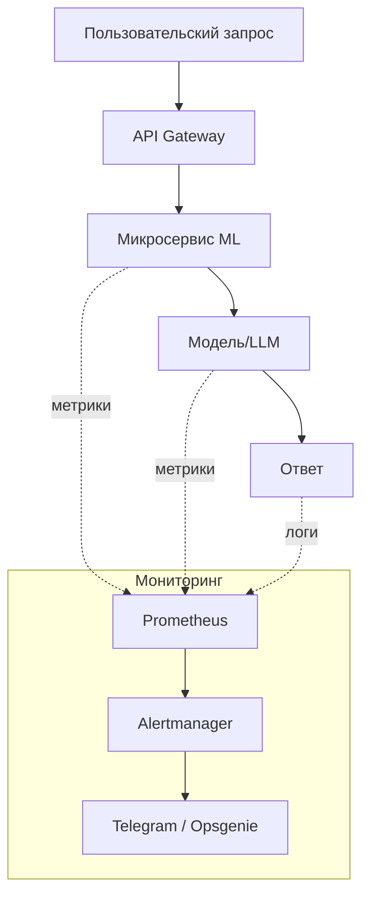

## Карта курса



---

## Маршрут вебинара



---

## Цели вебинара

| Смысл | К концу занятия вы сможете |
| :--- | :--- |
| **Для чего вам это уметь** <br> Различать метрики, логи, трейсы и знать, как они помогают контролировать ML-системы | 1. Понимать, что включает в себя Observability |
| **Для чего вам это уметь** <br> Отличать полезные алерты от шума и выстраивать полезную систему уведомлений | 2. Понимать, что такое алертинг и правила его настройки |
| **Для чего вам это уметь** <br> Контролировать доступность и состояние ML-сервиса и сразу реагировать на сбои | 3. Настроить алерт микросервиса с отправкой уведомлений в Telegram |

---

# Observability (Наблюдаемость)

## Определение

> **Observability** — это способность системы давать достаточно информации о своём внутреннем состоянии, чтобы мы могли понять, что происходит, и быстро находить причины проблем.

---

## Компоненты observability



### Метрики
- **Что это:** Числовые показатели, описывающие состояние системы или её компонентов.
- **Инструменты:** Prometheus + Grafana, VictoriaMetrics, InfluxDB.

### Логи
- **Что это:** Текстовые записи событий (ошибки, статусы операций, сообщения от приложений).
- **Инструменты:** ELK stack (Elasticsearch, Logstash, Kibana), Loki + Grafana, Syslog, VictoriaLogs.

### Трейсинг
- **Что это:** Сбор информации о прохождении запроса через разные сервисы, включая время каждого шага.
- **Инструменты:** Jaeger, Zipkin, OpenTelemetry.

---

## Компоненты observability в ML

В ML-системах observability включает контроль качества данных и моделей, а не только инфраструктуры:

- **Мониторинг качества данных и моделей:** Evidently AI, WhyLabs, Arize.
- **Отслеживание экспериментов и метрик моделей:** MLflow, ClearML, Weights & Biases.
- **Наблюдаемость LLM-приложений:** Langfuse (трассировка, метрики качества, аналитика промптов).

---

## Ключевые тезисы блока Observability

1. **Observability = метрики + логи + трейсы**.
2. В ML критично наблюдать и за инфраструктурой, и за приложением, и за данными, и за моделью.

---

# Алертинг (Alerting)

## Определение

> **Алертинг** — это сигнал для действия, автоматически формируемый при выполнении условия над телеметрией (метрики, логи, трейсы, проверки данных).

**Важное различие:**
- **Метрика** — сырые измерения.
- **Алерт** = метрика(и) + условие + приоритет + доставка.



---

## Для чего нужны алерты

1. Ранняя реакция на сбои
2. Поддержка SLA/SLO
3. Защита бизнес-метрик
4. Сокращение времени обслуживания системы
5. Автоматизация и self-healing
6. Предотвращение проблем заранее
7. Поддержка командной работы и эскалации

---

## Время обслуживания системы и доступность

**Доступность** — характеристика, показывающая, какую часть времени сервис был работоспособен.

Формула:
```
Доступность = (Согласованное время обслуживания – Время простоя) / Согласованное время обслуживания * 100
```

| Доступность % | Время простоя в год |
| :--- | :--- |
| 99.8 | 17.52 ч |
| 99.9 | 8.76 ч |
| 99.95 | 4.38 ч |
| 99.99 | 0.876 ч |
| 99.999 | 0.087 ч |

---

## Состав алерта (5 компонентов)

1. **Название** – кратко о проблеме.
2. **Описание** – что именно пошло не так.
3. **Severity (критичность)** – насколько серьёзно.
4. **Источник** – какой компонент/сервис.
5. **Инструкция по действиям** – что делать при получении.

---

## Типы правил для алертов

1. **Threshold** – превышение порога (например, CPU > 80%).
2. **Rate of change** – резкое изменение (например, ошибки выросли на 200% за 5 минут).
3. **Absence/Heartbeat** – отсутствие сигнала (сервис не отвечает).
4. **Anomaly** – аномалия на основе машинного обучения.
5. **Composite** – комбинация нескольких условий.

---

## Классификация алертов

### По severity (критичности) сервиса
- **Critical** – полная недоступность.
- **Error** – частичная потеря функциональности.
- **Warning** – потенциальная проблема.
- **Info** – информационное уведомление.

### По источнику алерта
- Микросервисы
- Базы данных
- Очереди/топики (Kafka)
- ML-данные

### По критичности системы (бизнес-уровни)
- **Mission Critical** – остановка бизнеса.
- **Business Critical** – серьёзное влияние на бизнес.
- **Business Operational** – влияет на операции, но не критично.
- **Office Productivity** – внутренние сервисы.

---

## Системы управления алертами

- **Сбор метрик:** Prometheus, Grafana, Sentry.
- **Обработка алертов:** Prometheus Alertmanager, Grafana Alerting.
- **Диспетчеризация уведомлений:** Opsgenie, PagerDuty, VictorOps.

---

## Примеры метрик для алертов

### Инференс/онлайн-сервисы
- Latency (задержка)
- CPU/GPU/RAM/Disk Usage
- Error Rate
- Request Rate

### Пайплайны и очереди
- Orchestration SLA
- Kafka/Queues: consumer lag
- Batch freshness (свежесть данных)

### Данные и модель
- Качество модели (Accuracy, F1, и т.д.)
- Дрейф данных/признаков
- Стабильность предсказаний
- Валидация данных (наличие, формат)

### Трейсинг для LLM
- Рост доли неуспешных tool/function-calls
- Таймауты шагов в цепочке
- Рост стоимости/токенов на запрос

---

## LLM-метрики (специфичные для AI)

- **Метрики качества:** Relevance, Correctness, Completeness, Consistency, Style.
- **Метрики RAG:** Context Relevance, Context Coverage, Faithfulness, Retrieval метрики (Recall@k, Precision@k).
- **Метрики для чат-ботов:** Task Success, диалоговые метрики.
- **Безопасность и политики:** Токсичность, PII, Policy violations.
- **Мониторинг деградаций:** Query drift, Response drift, Retrieval drift.

**Инструменты для LLM-метрик:** Helicone, Langfuse, Ragas, DeepEval.

---

## Правила хорошего алерта

1. **Actionable** – по нему можно предпринять конкретное действие.
2. **Sensible severity** – адекватная критичность.
3. **Alert fatigue** – избегать избыточности (не должно быть шума).
4. **Ясность и контекст** – понятное описание и ссылки на дашборды.
5. **Привязка к SLO/бизнес-метрикам** – алерт имеет бизнес-смысл.
6. **Testable** – можно протестировать (например, симулировать сбой).

---

## Что делать, если пришёл алерт

| **Что делать** | **Что не делать** |
| :--- | :--- |
| 1. Уведомить заказчика/бизнес о проблеме | • Искать виноватых вместо действий |
| 2. Проверить логи, метрики, трейсы, дашборды | • Игнорировать или откладывать алерт |
| 3. Проверить чаты/алерты смежных систем | • Решать ложный/неложный без проверки |
| 4. Начать устранение проблемы | • Сообщать, что починили, если нет 100% уверенности |
| 5. Написать постмортем и закрыть его (с исправлениями) | |
| 6. Если алерт оказался бесполезным — удалить его | |
| 7. Если алерт полезный — похвалить себя | |

---

## Ключевые тезисы блока Алертинг

1. Алерты = метрики + правила + уведомления → actionable сигналы.
2. Классификация: по severity, источнику, критичности системы.
3. Алерты помогают вовремя реагировать и защищать SLA и бизнес-метрики.
4. **Сначала починить, потом обсуждать.**
5. Регулярно проводите ревью ваших алертов.

---

# Пример практической реализации

На вебинаре была показана топология в Kubernetes и путь данных от запроса до алерта.



**Что сделали:** настроили сбор метрик (латентность, ошибки, использование GPU), создали правила алертинга (threshold) и настроили отправку уведомлений в Telegram.

---

# Подведём итоги занятия

1. Алертинг строится на метриках, но превращает их в **actionable сигналы**.
2. Хорошие алерты снижают шум и помогают фокусироваться на реально важных проблемах.
3. Алерты и наблюдаемость связывают технические события с **бизнес-метриками**.
4. Культура работы с инцидентами (postmortem, пересмотр алертов) делает систему надёжнее со временем.

---

## Теперь вы сможете

1. **Понимать, что включает в себя Observability** – различать метрики, логи, трейсы и знать, как они помогают контролировать ML-системы.
2. **Понимать, что такое алертинг и правила его настройки** – отличать полезные алерты от шума и выстраивать полезную систему уведомлений.
3. **Настроить алерт микросервиса с отправкой уведомлений в Telegram** – на практике контролировать доступность и состояние ML-сервиса и сразу реагировать на сбои.

---

## Список материалов для изучения

1. Статья: *Классификация критичности информационных систем*
2. Статья: *Человеческим языком про метрики 2: Prometheus*
3. Статья: *Что такое цель по уровню обслуживания (SLO)?*
4. Документация: *Configure Alertmanager*
5. Книги: *Google SRE books*
6. Практика: *Jaeger live demo*

---
