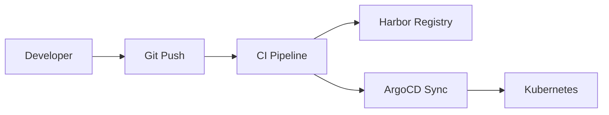
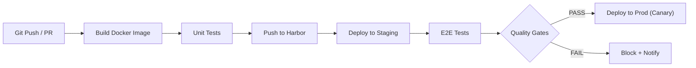
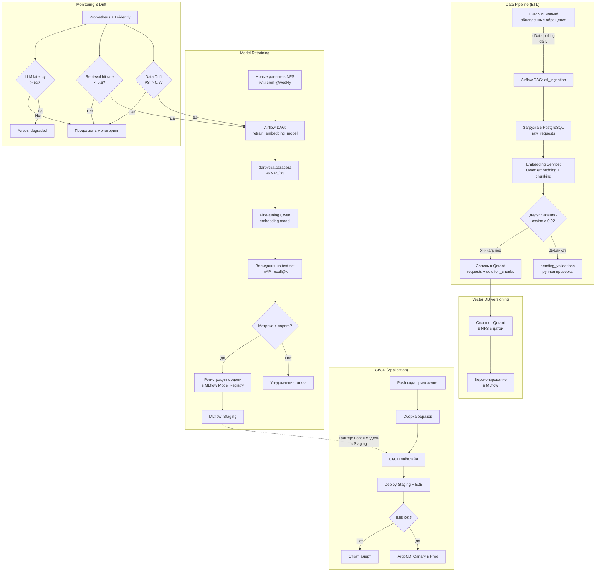
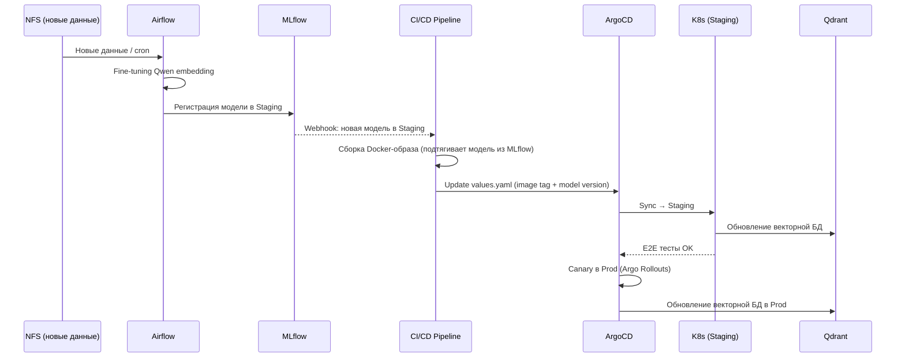

# Автоматизированный пайплайн поставки AI-сервиса (RAG-ассистент для ERP)

## 1. Infrastructure as Code (IaC) — псевдокод Terraform

Конфигурации подсетей, как и нод скорее всего будут согласовываться и управляться через заявки в отдельной корп. системе. здесь terraform просто для примера. 

Terraform управляет **K8s-кластером** и разворачивает все приложения через `helm_release` прямо из Terraform. ArgoCD отвечает за GitOps, но первичный деплой — из Terraform.

```hcl
# main.tf — корневая конфигурация

# ============================================
# 1. VPC и подсети (изоляция окружений)
# ============================================

resource "kubernetes_network" "erp_ai" {
  name = "erp-ai-network"
}

resource "kubernetes_subnet" "general" {
  name       = "general-subnet"
  cidr_block = "10.1.0.0/24"
  network_id = kubernetes_network.erp_ai.id
}

resource "kubernetes_subnet" "gpu" {
  name       = "gpu-subnet"
  cidr_block = "10.1.1.0/24"
  network_id = kubernetes_network.erp_ai.id
}

# ============================================
# 2. Kubernetes Cluster
# ============================================

resource "kubernetes_cluster" "erp_ai" {
  name    = "erp-ai-cluster"
  version = "1.29"

  node_pool {
    name       = "general"
    count      = 3
    cpu        = "8"
    memory     = "32Gi"
    disk       = "200Gi"
  }

  node_pool {
    name       = "gpu"
    count      = 2
    cpu        = "8"
    memory     = "64Gi"
    disk       = "500Gi"
    gpu        = "nvidia-a100"  # для Qwen embedding + LLM
  }
}

# ============================================
# 3. PostgreSQL (raw_requests, pending_validations, метаданные)
# ============================================

resource "helm_release" "postgresql" {
  name  = "erp-ai-postgres"
  chart = "oci://registry.internal/bitnami/postgresql"

  set {
    name  = "primary.persistence.size"
    value = "100Gi"
  }

  set {
    name  = "auth.database"
    value = "erp_ai"
  }

  set {
    name  = "auth.username"
    value = "erp_ai_app"
  }

  set {
    name  = "primary.resources.requests.memory"
    value = "8Gi"
  }

  set {
    name  = "primary.resources.limits.memory"
    value = "16Gi"
  }
}

# Схемы: bronze (raw), pending_validations (дубликаты на ручную проверку)

# ============================================
# 4. Qdrant (векторная БД: requests + solution_chunks)
# ============================================

resource "helm_release" "qdrant" {
  name  = "erp-ai-qdrant"
  chart = "oci://registry.internal/qdrant/qdrant"

  set {
    name  = "persistence.size"
    value = "50Gi"
  }

  set {
    name  = "resources.requests.memory"
    value = "8Gi"
  }

  set {
    name  = "resources.limits.memory"
    value = "16Gi"
  }

  # Коллекции создаются при первом upsert через API
  # requests — полные обращения
  # solution_chunks — чанки решений
}

# ============================================
# 5. Redis (кэш результатов поиска, TTL 15 мин)
# ============================================

resource "helm_release" "redis" {
  name  = "erp-ai-redis"
  chart = "oci://registry.internal/bitnami/redis"

  set {
    name  = "master.persistence.size"
    value = "10Gi"
  }

  set {
    name  = "master.resources.requests.memory"
    value = "1Gi"
  }

  set {
    name  = "master.config"
    value = <<-EOT
      maxmemory 512mb
      maxmemory-policy allkeys-lru
      timeout 300
    EOT
  }
}

# ============================================
# 6. Qwen Model Serving (GPU-ноды)
# ============================================

resource "helm_release" "qwen_serving" {
  name  = "erp-ai-qwen"
  chart = "oci://registry.internal/vllm/vllm"

  set {
    name  = "model"
    value = "Qwen/Qwen3.5-35B"  # LLM
  }

  set {
    name  = "resources.limits.nvidia.com/gpu"
    value = "1"
  }

  set {
    name  = "resources.requests.memory"
    value = "32Gi"
  }

  node_selector {
    key      = "nvidia.com/gpu"
    value    = "true"
  }
}

# Отдельный деплой для embedding-модели (лёгче, можно на CPU)
resource "helm_release" "qwen_embedding" {
  name  = "erp-ai-qwen-embedding"
  chart = "oci://registry.internal/text-embedding"

  set {
    name  = "model"
    value = "Qwen/Qwen3-Embedding-0.6B-GGUF"
  }

  set {
    name  = "resources.requests.memory"
    value = "8Gi"
  }
}

# ============================================
# 7. MinIO (S3-совместимое хранилище для артефактов)
# ============================================

resource "helm_release" "minio" {
  name  = "erp-ai-minio"
  chart = "oci://registry.internal/minio/minio"

  set {
    name  = "persistence.size"
    value = "200Gi"
  }

  set {
    name  = "mode"
    value = "standalone"
  }

  set {
    name  = "rootUser"
    value = "minio-admin"
  }

  set {
    name  = "rootPassword"
    value = var.minio_password
  }
}

# Бакеты:
# - mlflow-artifacts (модели, чекпоинты)
# - etl-backups (бэкапы, снэпшоты Qdrant, датасеты)

# ============================================
# 8. HashiCorp Vault (секреты)
# ============================================

resource "helm_release" "vault" {
  name  = "erp-ai-vault"
  chart = "oci://registry.internal/hashicorp/vault"

  set {
    name  = "server.dev.enabled"
    value = "false"
  }

  set {
    name  = "server.standby.enabled"
    value = "true"
  }

  set {
    name  = "server.replicas"
    value = "3"
  }

  set {
    name  = "server.persistence.size"
    value = "50Gi"
  }
}

# ============================================
# 9. Observability (Prometheus + Grafana)
# ============================================

resource "helm_release" "monitoring" {
  name  = "erp-ai-monitoring"
  chart = "oci://registry.internal/prometheus-community/kube-prometheus-stack"

  set {
    name  = "grafana.adminPassword"
    value = var.grafana_password
  }

  set {
    name  = "prometheus.prometheusSpec.retention"
    value = "30d"
  }
}

# ============================================
# 10. Airflow (оркестрация ETL + MLOps)
# ============================================

resource "helm_release" "airflow" {
  name  = "erp-ai-airflow"
  chart = "oci://registry.internal/apache/airflow"

  set {
    name  = "executor"
    value = "KubernetesExecutor"
  }

  set {
    name  = "workers.persistence.size"
    value = "20Gi"
  }

  set {
    name  = "flower.persistence.enabled"
    value = "false"  # flower без persistence
  }

  set {
    name  = "webserver.secretKey"
    value = var.airflow_secret_key
  }
}

# ============================================
# 11. ArgoCD (GitOps)
# ============================================

resource "helm_release" "argocd" {
  name  = "erp-ai-argocd"
  chart = "oci://registry.internal/argo/argo-cd"

  set {
    name  = "server.enableGrpc"
    value = "true"
  }

  set {
    name  = "repoServer.autoscaling.enabled"
    value = "true"
  }

  set {
    name  = "controller.autoscaling.enabled"
    value = "true"
  }
}

# ============================================
# 12. Container Registry (Harbor)
# ============================================

resource "helm_release" "harbor" {
  name  = "erp-ai-harbor"
  chart = "oci://registry.internal/goharbor/harbor"

  set {
    name  = "expose.ingress.hosts.core"
    value = "harbor.internal"
  }

  set {
    name  = "persistence.persistentVolumeClaim.registry.storageClass"
    value = "local-ssd"
  }

  set {
    name  = "persistence.persistentVolumeClaim.registry.size"
    value = "100Gi"
  }

  set {
    name  = "harborAdminPassword"
    value = var.harbor_password
  }
}
```

**Обзор ресурсов:**

| Компонент | Назначение | Ресурсы |
|-----------|------------|---------|
| VPC + Подсети | Изоляция окружений (general / gpu) | general: 10.1.0.0/24, gpu: 10.1.1.0/24 |
| K8s Cluster | Оркестрация всех сервисов | 3x general (8CPU/32Gi) + 1x GPU (8CPU/64Gi/nvidia-a100) |
| PostgreSQL | Данные (raw_requests, pending_validations, логи) | 100Gi storage, 8-16Gi RAM |
| Qdrant | Векторный индекс (requests + solution_chunks) | 50Gi storage, 8-16Gi RAM |
| Redis | Кэш результатов поиска (TTL 15 мин) | 10Gi storage, 1Gi RAM |
| Qwen Serving (LLM) | Генерация ответов | 1x GPU (nvidia-a100), 64Gi RAM |
| Qwen Embedding | Генерация эмбеддингов | 8Gi RAM |
| MinIO | Артефакты моделей, бэкапы, датасеты | 200Gi storage |
| Vault | Секреты и ротация ключей | 3 replicas, 50Gi storage |
| Airflow | Оркестрация ETL + MLOps DAG | 20Gi worker storage |
| Prometheus + Grafana | Метрики и алерты | 30d retention |
| ArgoCD | GitOps-синхронизация | autoscaling |
| Harbor | Container Registry | 100Gi storage |

## GitOps (Helm + ArgoCD)

Разделение ответственности между Terraform и ArgoCD:

- **Terraform** — инфраструктура: VPC, K8s-кластер, базы данных, сервисы моделирования, оркестрацию и наблюдаемость. Первичный деплой — из Terraform.
- **ArgoCD** — прикладные сервисы: AI Service (Python), Gateway (Java), ETL Worker (Python), Admin (Java). 



**Прикладные сервисы (деплой через ArgoCD):**

| Сервис | Стек | Назначение |
|--------|------|------------|
| AI Service | Python FastAPI | Оркестратор RAG-пайплайна |
| Gateway | Java Spring Cloud Gateway | Маршрутизация, аутентификация, rate-limit |
| ETL Worker | Python | Polling oData ERP, трансформация, вставка в PG |
| Admin | Java Spring Boot + Thymeleaf | Админ-панель для мониторинга и ручной валидации |

---

## 2. CI/CD Pipeline

### Схема пайплайна



### Этапы

| Этап | Описание | Инструменты |
|------|----------|-------------|
| **Build Docker** | Multi-stage build: Python (AI Service) + Java (Gateway/Admin) | Docker, Harbor |
| **Unit Tests** | pytest для Python, JUnit для Java | CI Runner |
| **Push to Registry** | Пуш в on-prem Harbor | Harbor |
| **Deploy to Staging** | Helm-чарт в namespace `staging` | ArgoCD |
| **E2E Tests** | Интеграционные тесты + RAG Quality Gates | pytest |
| **Quality Gates** | Retrieval hit rate ≥ 0.6, latency P99 ≤ 3с | CI Runner |
| **Deploy to Prod** | Canary-деплой (1% → 5% → 25% → 100%) | Argo Rollouts + Istio |

---

### Release Strategy — Canary Deployment

**Стратегия:** Canary Release через Argo Rollouts + Istio.

В production работает стабильная версия `v1` AI Service с 100% трафика. Новая версия `v2` (обновлённый код + новая модель из MLflow) развёрнута параллельно.

#### Шаги переключения трафика

| Шаг | Вес канарейки | Длительность | Что проверяется |
|-----|---------------|--------------|-----------------|
| **1** | 1% | 5 минут | Доступность сервиса, HTTP 5xx, latency P99 |
| **2** | 5% | 30 минут | K8s метрики: CPU, memory и т.д. |
| **3** | 25% | 60 минут | ML Метрики |
| **4** | 100% | — | Полный перевод. Откат только ручной |

#### Метрики для отката (Rollback triggers)

| Категория | Метрика | Порог для отката | Источник |
|-----------|---------|------------------|----------|
| **HTTP SLO** | HTTP 5xx rate | > 1% за 5 мин | Prometheus (`istio_requests_total`) |
| | Latency P99 | > 5000 мс | Prometheus |
| | Latency P50 | > 2000 мс | Prometheus |
| **K8s** | CPU usage | > 85% sustained 10 мин | Kubernetes metrics |
| | Memory usage | > 90% sustained 10 мин | Kubernetes metrics |
| | Pod restarts | > 2 за 15 мин | Kubernetes |
| **ML: Retrieval** | Retrieval hit rate | < 0.6 | AI Service metrics |
| | Qdrant search latency P99 | > 500 мс | AI Service metrics |
| | Embedding latency P99 | > 1000 мс | AI Service metrics |
| **ML: Drift** | PSI (Population Stability Index) | > 0.2 | Evidently |
| | Feature distribution change | KS-test p < 0.01 | Evidently |
| **ML: LLM** | LLM generation latency P99 | > 5000 мс | AI Service metrics |
| | LLM error rate | > 2% | AI Service metrics |
| **Бизнес** | User feedback (дизлайки) | > 30% | Аналитика |
| | Direction-specific accuracy | падение > 10% | Аналитика |

#### Процедура автоматического отката

1. **Автоматический (Argo Rollouts):** При срабатывании любого `analysis` с `failureLimit` — Rollouts немедленно останавливает канарейку и возвращает `setWeight: 0` для v2.
2. **Критический (immediate):** При `critical-errors > 0` — мгновенный откат без ожидания паузы.
3. **Ручной:** Инцидент с деталями: какие метрики вышли за порог, на каком шаге канарейки.
4. **Модель:** Старая версия модели остаётся в `Production` в MLflow и не удаляется.
5. **Векторная БД:** При откате AI Service продолжает использовать последнюю валидную векторную базу (снэпшот из NFS).

## 3. MLOps Integration — связь пайплайна с обучением модели

### Общая схема (MLOps + CI/CD)


#### 3.1. Fine-tuning embedding-модели

ML-модель используется только для формирования ответа пользователю на основе собранных решений и чанков. Допускаем, что ее дообучение не потребуется, максимум корректировки промптов.

**Embedding-модель**
**Метод:** Contrastive learning (Multiple Negatives Ranking Loss). Модель обучается на парах (query, relevant_solution), где все остальные solution в батче выступают как негативы.

**Откуда берутся данные для fine-tune:**
- Подтверждённые дубликаты из `pending_validations` → позитивные пары (anchor, positive).
- История успешных поисковых запросов: запрос пользователя → решение, которое он принял → пара (query, solution).
- Логи с высоким retrieval hit rate → позитивные примеры.

**Цель:** увеличить расстояние между семантически разными обращениями и сблизить дубликаты.

#### 3.2. Data Drift для embedding-модели

Старая embedding-модель перестаёт адекватно покрывать новые запросы: векторы новых обращений ложатся «не туда» в пространстве, retrieval hit rate падает.

**Как измеряется:**
- **PSI (Population Stability Index) на эмбеддингах:** сравниваем распределение эмбеддингов за период A (месяц назад) и период B (текущий). PSI > 0.2 → значимый сдвиг.
- **Retrieval hit rate < 0.6:** если раньше модель находила релевантные решения в 80% случаев, а теперь в 55% — модель «устарела» относительно данных.

Оба сигнала триггерят Airflow DAG `retrain_embedding_model`.

#### 3.3. MLflow Model Registry

| Стадия | Описание |
|--------|----------|
| **None** | Модель обучена, логируется в MLflow с параметрами и метриками |
| **Staging** | Модель прошла валидацию (mAP > 0.75, recall@10 > 0.85). CI/CD подтягивает для E2E-тестов |
| **Production** | Модель прошла Canary-релиз. AI Service использует эту версию |
| **Archived** | Модель заменена новой или не прошла валидацию |

#### 3.4. Интеграция MLOps с CI/CD



#### 3.5. Версионирование векторной базы (RAG)
    Создание снэпшота Qdrant после успешного обновления.
    Снэпшот сохраняется в NFS с меткой даты.


---
