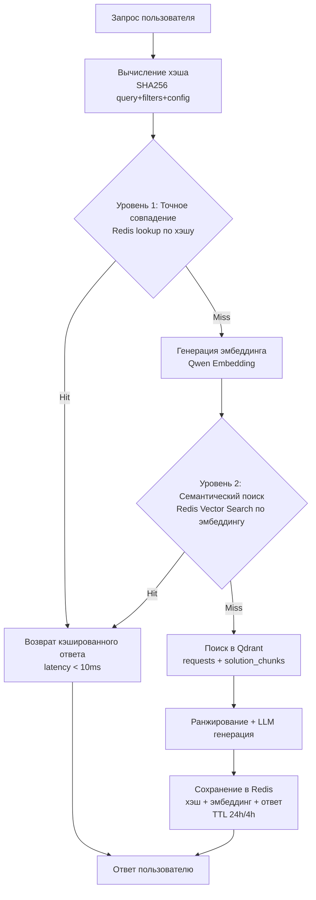
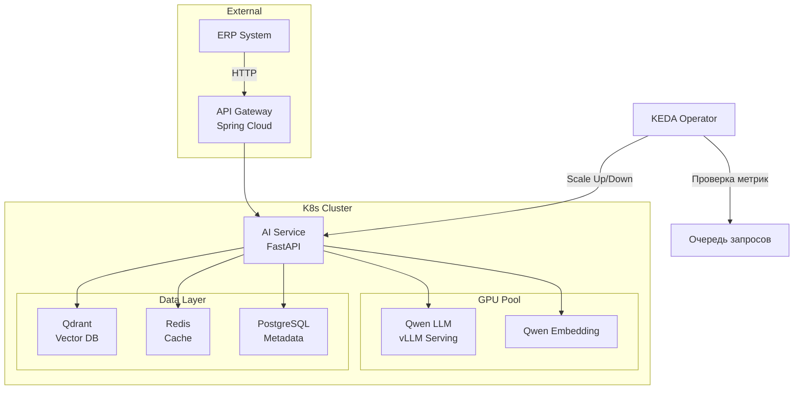
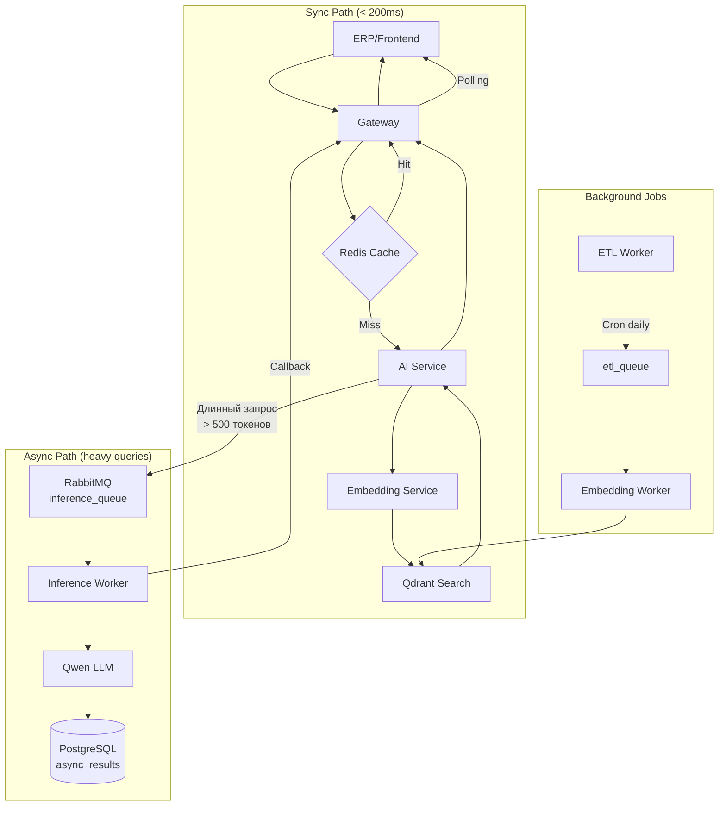
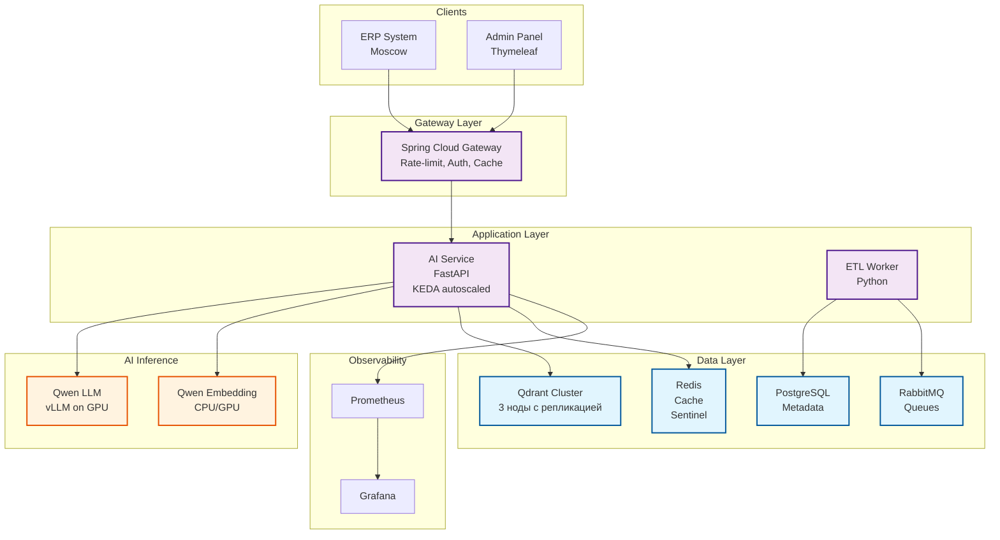

# Архитектура High-Load AI-сервиса: RAG-ассистент для ERP

## Задание

Сервис вырос. Теперь нагрузка 10,000 RPS, а требование по Latency < 200ms. Нижепредставленная архитектура масштабируется с учётом ограничений on-prem развёртывания и требований безопасности (запрет на внешние облака).

**Почему нет географического распределения:**
Все запросы поступают из ERP-системы, которая полностью расположена в Москве. Техподдержка работает локально с ERP — нет пользователей в других регионах, которым нужно снижать latency. Распределение данных и инференса по регионам не даёт выгоды, но увеличивает стоимость инфраструктуры и сложность репликации.

---

### Выбор Kubernetes вместо Serverless

| Критерий | Kubernetes | Serverless |
|----------|------------|------------|
| **Stateful модели** | ✅ Долгоживущие поды с прогретыми моделями | ❌ Холодный старт 30-60с |
| **On-prem** | ✅ Полный контроль | ❌ Vendor lock |
| **Batch inference** | ✅ vLLM batching на GPU | ❌ Ограничения по времени |
| **ИБ: изоляция данных** | ✅ Все данные внутри периметра компании | ❌ Данные уходят в облако провайдера |
| **ИБ: mTLS** | ✅ Между всеми контейнерами в кластере | ❌ Ограниченный контроль |
| **ИБ: шифрование** | ✅ PG/Qdrant/Vault на своих нодах | ❌ Зависит от провайдера |

**Вывод:** Для ML-инференса с требованиями latency < 200ms, on-prem развёртывания и политики безопасности Kubernetes — единственный вариант. 

### Отказоустойчивость

**Qdrant кластер:**
- Развёрнут в кластерном режиме (не менее 3 нод) с репликацией
- Автоматическое переключение при отказе ноды

**PostgreSQL:**
- Буферизация записей (batch insert) для снижения нагрузки при 10k RPS
- Отдельный инстанс для аналитики (ClickHouse) при необходимости

### Кэширование

**Semantic Cache** снижает нагрузку на LLM на **60-80%** для повторяющихся запросов. Двухуровневый кэш в одном Redis:

1. **Уровень 1 — Точное совпадение:** SHA256 хэш → Redis lookup → O(1), < 10мс
2. **Уровень 2 — Семантически похожее:** Эмбеддинг запроса → Redis Vector Search (HNSW) → поиск похожего запроса в кэше → возврат кэшированного ответа без вызова LLM

**Преимущество:** Семантический поиск идёт по **кэшу** (Redis), а не по основной базе знаний (Qdrant). При нахождении похожего запроса — мгновенный ответ без генерации LLM.

**Параметры:**
- TTL (точное совпадение): 24 часа — база знаний обновляется раз в сутки
- TTL (семантически похожий): 4 часа — похожий запрос → ответ может быть неточным
- maxmemory 2–4 ГБ, allkeys-lru — LRU-эвикция при нехватке памяти
- GZIP сжатие для значений — снижение объема кэша
- Инвалидация: TTL + **автоматическая при обновлении БД** + ручная через Admin API

**Инвалидация кэша при обновлении базы знаний:**
- ETL Worker при обновлении Qdrant отправляет событие в Redis (pub/sub)
- Redis инвалидирует все ключи, связанные с обновлёнными обращениями

**KV Cache** в LLM сокращает время prefill на **40-60%** за счёт кэширования системного промпта (~2K токенов) в GPU memory.

### Масштабирование

**KEDA** обеспечивает реактивное масштабирование по двум метрикам:

1. **CPU utilization** — для горизонтального масштабирования non-GPU сервисов
2. **Latency P99** — для поддержания SLA < 200ms

**Прогнозирующее масштабирование:**
- Cron-триггер для предсказуемых пиков (рабочие дни 8:00–18:00)
- В рабочие часы desiredReplicas=10 для предотвращения холодного старта
- Вне рабочих часов minReplicaCount=3 (базовый)

**Особенности ML:**
- minReplicaCount=3 (базовый) предотвращает холодный старт
- cooldownPeriod=60s стабилизирует масштабирование
- GPU ноды **статичны** (on-prem с фиксированным количеством GPU)
- Пороги требуют калибровки на нагрузочном тестировании

### Асинхронная обработка

**Queue-based модель** решает проблему долгих LLM-запросов:

1. **Синхронный путь** — возврат из кэша (Cache Hit) или результатов векторного поиска без LLM-генерации (Cache Miss). Эмбеддинг + Qdrant занимают ~160 мс, что укладывается в SLA <200 мс. При этом запрос на LLM-генерацию отправляется в асинхронную очередь, а результат возвращается пользователю с пометкой `processing`/`degraded`. Если же клиент требует полный LLM-ответ синхронно (не предусмотрено в текущем дизайне), такой запрос сразу возвращает `202 Accepted`.
2. **Асинхронный путь** — для всех запросов, требующих генерации LLM. Результат в PostgreSQL, polling клиентом.
3. **Batching** — группировка запросов для увеличения GPU утилизации (0.5s window, max 32). Применяется **только в асинхронном пути**.

**Важно:** Требование <200 мс распространяется на синхронный ответ из кэша и на результаты векторного поиска без LLM. Для генерации LLM допустимое время ответа составляет 3–5 секунд, что соответствует пользовательскому сценарию работы службы поддержки.

**RabbitMQ** выбирается вместо Kafka для inference queue:

**Обоснование выбора:**
- **Модель "очередь задач"** — каждый запрос обрабатывается один раз (Ack после обработки). Kafka — это лог событий, сообщения хранятся N дней и могут быть перечитаны.
- **Простота** — для inference queue не нужен replay, ordering по partition key, или хранение истории. Нужен простой: publish → consume → ack.
- **Latency** — RabbitMQ даёт более низкую задержку доставки (~мс), чем Kafka (буферизация в batch).
- **10k RPS** — RabbitMQ справляется с текущей нагрузкой.

**Когда Kafka была бы лучше:**
- Replay (перечитать историю запросов)
- Строгий ordering по пользователю
- Throughput > 100k RPS

### Latency оптимизации

| Этап | Целевое время (Cache Hit) | Целевое время (Cache Miss) | Оптимизация |
|------|---------------------------|----------------------------|-------------|
| Cache lookup | < 10 мс | < 10 мс | Redis in-memory |
| Embedding | — | < 100 мс | Qwen-0.6B (лёгкая модель) |
| Vector search | — | < 50 мс | Qdrant ANN, HNSW index |
| LLM generation | — | < 3 с (лёгкий) / < 5 с (тяжёлый) | KV Cache, batch inference, асинхронная очередь |
| **Total** | **< 200 мс** | **< 3–5 с** | |

**Важно:** Требование <200 мс распространяется только на синхронный ответ из кэша. Для всех запросов, требующих генерации LLM (Cache Miss), допустимое время ответа составляет 3–5 секунд, что соответствует пользовательскому сценарию работы службы поддержки и позволяет сохранить высокое качество ответов. Тяжёлые запросы дополнительно выносятся в асинхронную очередь с уведомлением о готовности.


## 1. Caching Strategy

### Многоуровневая стратегия кэширования

```
┌─────────────────────────────────────────────────────────────────┐
│                        CDN Layer (nginx)                        │
│         Статика: admin-panel, health-check, метаданные         │
│         TTL: 60с для health, нет для API                       │
├─────────────────────────────────────────────────────────────────┤
│                     API Gateway Cache                          │
│         Rate-limit, request deduplication                      │
│         X-Idempotency-Key → 60с                                 │
├─────────────────────────────────────────────────────────────────┤
│                   Semantic Cache (Redis)                       │
│         Query results, TTL 24 часа/4 часа                         │
│         Key: SHA256(query + filters + config)                  │
├─────────────────────────────────────────────────────────────────┤
│                     KV Cache (внутри LLM)                     │
│         Prefix cache для повторяющихся промптов               │
│         Sistemny prompt + context хранятся в GPU memory        │
└─────────────────────────────────────────────────────────────────┘
```

### Semantic Cache — алгоритм



**Ключевые особенности:**

| Параметр | Значение | Обоснование |
|----------|----------|-------------|
| Key hash | SHA256(query + metadata_filters + config) | Точное совпадение параметров запроса |
| TTL (точное совпадение) | 24 часа | База знаний обновляется раз в сутки, точный запрос → ответ актуален до следующего обновления |
| TTL (семантически похожий) | 4 часа | Похожий запрос → ответ может быть неточным, нужно чаще обновлять |
| Invalidation | TTL + **автоматическая при обновлении БД** + ручная через Admin API | ETL Worker инвалидирует кэш при обновлении базы знаний |
| Size limit | maxmemory 2–4 ГБ, allkeys-lru | LRU-эвикция при нехватке памяти |
| Сжатие | GZIP для значений | Снижение объема кэша при больших JSON-ответах |
| Векторный индекс | Redis Vector Search (HNSW) | Семантический поиск похожих запросов в кэше |

**Инвалидация кэша при обновлении базы знаний:**
- ETL Worker при обновлении Qdrant отправляет событие в Redis (pub/sub)
- Redis инвалидирует все ключи, связанные с обновлёнными обращениями
- Альтернатива: FLUSHDB при каждом обновлении (проще, но менее гранулярно)

**Двухуровневый кэш (один Redis):**
1. **Уровень 1 — Точное совпадение:** SHA256 хэш → Redis lookup → O(1), < 10мс
2. **Уровень 2 — Семантически похожее:** Эмбеддинг запроса → Redis Vector Search (HNSW) → поиск похожего запроса в кэше → возврат кэшированного ответа без вызова LLM

**Преимущество:** Семантический поиск идёт по **кэшу** (Redis), а не по основной базе знаний (Qdrant). При нахождении похожего запроса — мгновенный ответ без генерации LLM.

### KV Cache (Prefix Cache)

Для LLM используется **prefix caching** — повторяющийся системный промпт и контекст кэшируются в GPU memory между запросами:

```
Системный промпт (~2K токенов) → KV Cache → 
При следующем запросе: только user query + retrieved context
```

**Эффект:** Экономия 40-60% времени prefill для повторяющихся промптов.

---

## 2. Scaling: KEDA Autoscaling

### Архитектура масштабирования



### KEDA ScaledObject для AI Service

```yaml
apiVersion: keda.sh/v1alpha1
kind: ScaledObject
metadata:
  name: ai-service-scaler
  namespace: erp-ai
spec:
  scaleTargetRef:
    name: ai-service
  pollingInterval: 15
  cooldownPeriod: 60
  minReplicaCount: 3
  maxReplicaCount: 50
  triggers:
    - type: prometheus
      metadata:
        serverAddress: http://prometheus:9090
        metricName: ai_cpu_utilization
        query: |
          avg(rate(container_cpu_usage_seconds_total{
            namespace="erp-ai",
            container="ai-service"
          }[2m])) * 100
        threshold: "70"
    - type: prometheus
      metadata:
        metricName: ai_latency_p99
        query: |
          histogram_quantile(0.99,
            sum(rate(ai_request_duration_seconds_bucket{
              namespace="erp-ai"
            }[2m])) by (le)
          ) * 1000
        threshold: "200"
    - type: cron
      metadata:
        start: "0 8 * * 1-5"
        end: "0 18 * * 1-5"
        desiredReplicas: "10"
```

### Метрики для масштабирования

| Метрика | Порог Scale Up | Порог Scale Down | Источник |
|---------|----------------|------------------|----------|
| CPU utilization | > 70% | < 30% | K8s metrics |
| Latency P99 | > 200ms | < 100ms | Prometheus |
| Cron (рабочие дни) | 8:00–18:00 | — | KEDA cron trigger |

**Примечание:** Пороги требуют калибровки на нагрузочном тестировании. Рекомендуется провести тест перед production.

### Проблема: Холодный старт модели занимает 30-60 секунд.

**Решения:**
1. **Pre-warming:** Maintain minReplicaCount=3 с подогретыми моделями
2. **Grace period:** cooldownPeriod=60s предотвращает частые scale up/down
3. **Predictive scaling:** Анализ паттернов нагрузки (часы пик в рабочие дни)

---

## 3. Async Processing: Queue-Based

### Архитектура асинхронной обработки



### Определение тяжёлых запросов

| Критерий | Порог | Действие |
|----------|-------|----------|
| Длина контекста | > 2000 токенов | Async queue |
| Ожидаемая длина ответа | > 500 токенов | Async queue |
| Timeout > 3с | Превышение SLA | Fallback + async |
| Batch requests | > 10 одновременно | Queue batching |

### Batching стратегия

Для увеличения GPU утилизации используется **dynamic batching**:

```
Запрос 1 ─┐
Запрос 2 ─┼─→ Batch Collector ──→ vLLM Inference ──→ Responses
Запрос N ─┘    (0.5s window)
```

**Параметры:**
- max_batch_size: 32
- batch_timeout: 500ms
- preferred_batch_size: 16

---

## 4. Схема архитектуры

