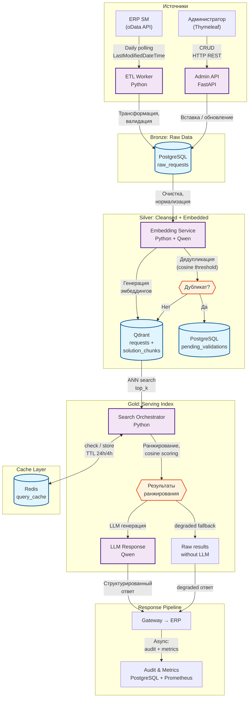

# Архитектура Data Pipeline: AI-ассистент для службы поддержки ERP

## Схема архитектуры данных



---

## Текстовое описание потока

### Обзор

Архитектура реализует **RAG-пайплайн** (Retrieval-Augmented Generation) с разделением на два независимых потока:

1. **Offline ETL Pipeline** — пополнение базы знаний из ERP по расписанию (1 раз/сутки)
2. **Online Query Pipeline** — обработка запросов пользователей в реальном времени

### Описание компонентов

#### 1. ETL Worker (Python)

Оркестрирует загрузку данных из ERP SM через штатный oData-интерфейс.

| Параметр | Значение |
|----------|----------|
| Протокол | oData REST API |
| Расписание | Daily (cron) |
| Фильтр | `LastModifiedDateTime > last_sync`, `Status = Closed` |
| Идемпотентность | Upsert по `RequestID` |
| Retry | Exponential backoff, max 3 attempts |
| Circuit Breaker | Отключение при >5 ошибок подряд, восстановление через 5 мин |

**Поток:**
```
oData ERP → ETL Worker → PostgreSQL (raw_requests) → Embedding Service → Qdrant
```

Этапы:
1. **Polling**: Запрос новых/изменённых обращений через oData с фильтром по дате модификации
2. **Трансформация**: Нормализация полей, валидация обязательных атрибутов
3. **Загрузка**: Вставка/обновление в PostgreSQL (`raw_requests`)

#### 2. Embedding Service (Python + Qwen)

Генерирует векторные представления и проверяет дубликаты.

| Параметр | Значение |
|----------|----------|
| Модель эмбеддинга | Qwen-embedding (on-prem) |
| Размерность | ~1024 (зависит от модели) |
| Чанкинг | Разбиение решений на чанки по ~500 токенов |
| Порог дедупликации | cosine similarity > 0.92 |

**Поток дедупликации:**
```
raw_requests → Генерация эмбеддинга запроса → Qdrant (top-1 search)
   → cosine similarity > threshold → duplicate → pending_validations
   → cosine similarity ≤ threshold → уникальное → solution_chunks в Qdrant
```

**Хранилища Qdrant:**
- `requests` — эмбеддинги полных текстов обращений
- `solution_chunks` — эмбеддинги чанков решений (с payload: request_id, chunk_text, direction)

#### 3. Search Orchestrator (Python)

Основной RAG-пайплайн для обработки запросов.

**Поток:**
```
Query → Redis cache check
   → [cache miss] → Embedding (Qwen) → Qdrant search (requests + solution_chunks)
   → Ranking (cosine scoring + dedup) → LLM generation (Qwen)
   → Response → Redis cache update → async Audit
   → [cache hit] → Cached response
```

**Ранжирование:**
- Поиск по коллекции `requests` (полные обращения) → top_k results
- Поиск по коллекции `solution_chunks` (чанки решений) → top_k results
- Если чанк принадлежит `solution`, которое уже есть среди полных решений → пропуск дубликата
- Финальный скор: `cosine_similarity × weight` (полные обращения × 1.0, чанки × 0.8)
- Фильтрация по `similarity_threshold`

**Fallback:**
- LLM timeout/error → возврат raw результатов векторного поиска с `status: degraded`
- Qdrant пуст → `status: empty`

#### 4. Cache Manager (Redis)

| Параметр | Значение |
|----------|----------|
| TTL (точное совпадение) | 24 часа |
| TTL (семантически похожий) | 4 часа |
| Key | SHA256(query + metadata_filters + config) |
| Value | Сериализованный JSON-ответ |
| Инвалидация | TTL + автоматическая при обновлении БД + ручная через Admin API |

#### 5. Audit & Metrics

Асинхронная запись метаданных после формирования ответа (не блокирует ответ пользователю).

| Метрика | Описание |
|---------|----------|
| request_latency_ms | Время обработки запроса |
| cache_hit_ratio | Доля попаданий в кэш |
| llm_latency_ms | Время генерации LLM |
| vector_search_latency_ms | Время векторного поиска |
| dedup_rejected_count | Количество отклонённых дубликатов |
| dedup_pending_count | Количество дубликатов на ручной валидации |

---

## Потоки данных

### Поток 1: Offline ETL (пополнение базы знаний)

```
┌─────────┐    oData     ┌──────────┐   SQL    ┌────────────┐
│ ERP SM  │ ──────────►  │ ETL      │ ──────► │ PostgreSQL │
│ (source)│   polling    │ Worker   │         │ raw_requests│
└─────────┘              └──────────┘         └─────┬──────┘
                                                     │
                                                     │ trigger
                                                     ▼
                                            ┌────────────────┐
                                            │ Embedding      │
                                            │ Service        │
                                            └───┬────────┬───┘
                                                │        │
                                    ┌───────────┘        └──────────┐
                                    ▼                               ▼
                           ┌─────────────┐               ┌──────────────────┐
                           │   Qdrant    │               │ pending_validations│
                           │ (requests + │               │ (дубликаты)       │
                           │  chunks)    │               └──────────────────┘
                           └─────────────┘
```

### Поток 2: Online Query (обработка запроса)

```
┌──────────┐  REST   ┌──────────┐  HTTP   ┌──────────┐
│ Gateway  │ ──────► │ AI       │ ◄─────► │ Redis    │
│          │         │ Service  │  cache  │(TTL 24h/4h)│
└──────────┘         └────┬─────┘         └──────────┘
                          │
              ┌───────────┼───────────┐
              ▼           ▼           ▼
       ┌──────────┐ ┌──────────┐ ┌──────────┐
       │ Qwen     │ │ Qdrant   │ │ Qwen     │
       │ Embedding│ │ ANN      │ │ LLM      │
       └──────────┘ │ Search   │ └────┬─────┘
                    └──────────┘      │
                                      ▼
                               ┌──────────┐
                               │ Response │
                               │ → ERP    │
                               └──────────┘
```

### Поток 3: Admin CRUD (управление базой знаний)

```
┌──────────────┐  Thymeleaf  ┌──────────────┐  REST  ┌──────────────┐
│ Администратор│ ──────────► │ Admin API    │ ──────► │ AI Service   │
│              │             │ (Spring Boot)│         │ (FastAPI)    │
└──────────────┘             └──────────────┘         └──────┬───────┘
                                                             │
                                                    ┌────────┼────────┐
                                                    ▼        ▼        ▼
                                              ┌──────┐ ┌─────────┐ ┌───────┐
                                              │PG    │ │ Qdrant  │ │ Redis │
                                              │      │ │         │ │       │
                                              └──────┘ └─────────┘ └───────┘
```